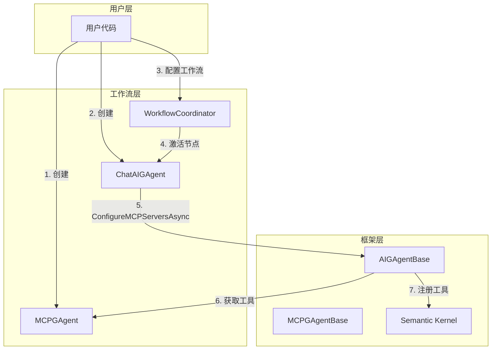
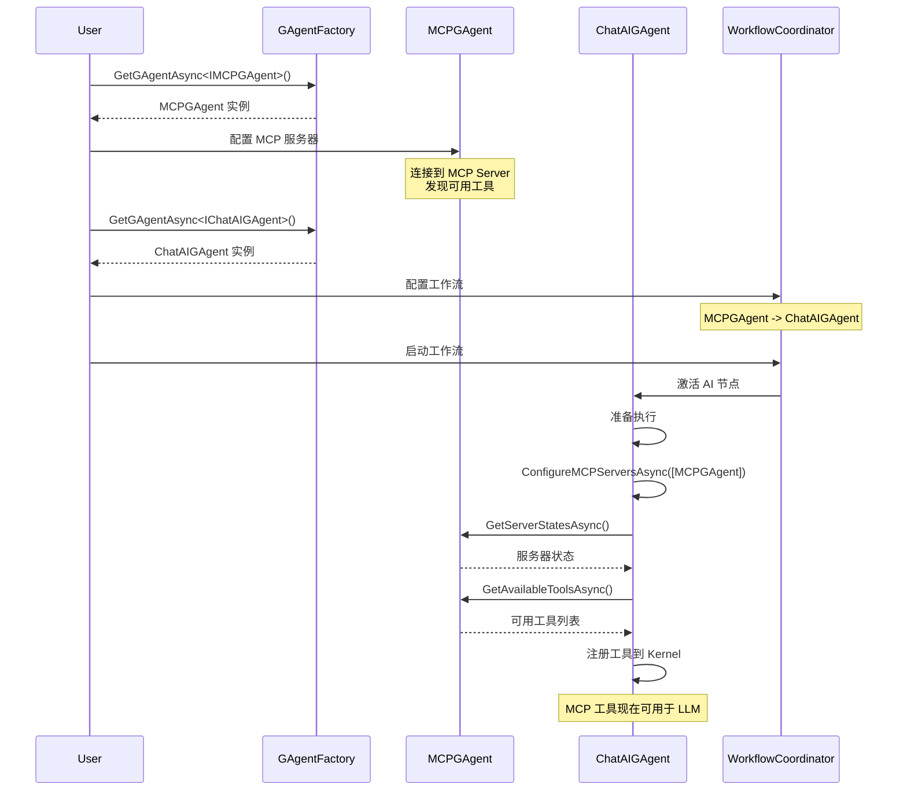

# MCP Workflow Integration - 实际实现方案

## 📋 概述

本文档记录了 Aevatar 系统中 MCP（Model Context Protocol）工具在工作流中的实际集成方案。该方案通过在 `AIGAgentBase` 中添加重载方法，实现了 MCPGAgent 与 ChatAIGAgent 的灵活集成。

## 🎯 核心设计

### 1. 重载方法设计

在 `AIGAgentBase.MCP.cs` 中添加了新的重载方法：

```csharp
public virtual async Task<bool> ConfigureMCPServersAsync(List<IMCPGAgent> mcpGAgents)
{
    try
    {
        var mcpAgents = new Dictionary<string, MCPGAgentReference>();

        foreach (var mcpAgent in mcpGAgents)
        {
            var mcpAgentId = mcpAgent.GetPrimaryKey();
            var server = (await mcpAgent.GetServerStatesAsync()).First();

            mcpAgents[server.ServerName] = new MCPGAgentReference
            {
                AgentId = mcpAgentId,
                ServerName = server.ServerName,
            };

            // 记录该服务器的可用工具
            var serverTools = await mcpAgent.GetAvailableToolsAsync();
            foreach (var (_, tool) in serverTools)
            {
                Logger.LogInformation($"Registered MCP tool: {server.ServerName}.{tool.Name} - {tool.Description}");
            }
        }

        // 更新状态
        var configureServersEvent = new ConfigureMCPServersStateLogEvent
        {
            MCPServers = mcpAgents
        };

        var enableMCPToolsEvent = new SetEnableMCPToolsStateLogEvent
        {
            EnableMCPTools = true
        };

        RaiseEvent(configureServersEvent);
        RaiseEvent(enableMCPToolsEvent);
        await ConfirmEvents();

        // 如果 Brain 已初始化，更新 Kernel 工具
        if (_brain != null)
        {
            await UpdateKernelWithMCPToolsAsync();
        }

        return true;
    }
    catch (Exception ex)
    {
        Logger.LogError(ex, "Failed to configure MCP servers");
        return false;
    }
}
```

### 2. 关键优势

- **简单直接**：直接传递 MCPGAgent 实例，无需复杂的资源发现机制
- **架构清晰**：不修改 framework 层，保持架构边界
- **灵活性高**：支持外部创建和管理 MCPGAgent 生命周期
- **向后兼容**：保留原有的 `ConfigureMCPServersAsync(List<MCPServerConfig>)` 方法

## 🏗️ 系统架构

### 组件关系图



### 执行流程



## 💻 实现细节

### 1. MCPGAgent 实现

MCPGAgent 继承自 `MCPGAgentBase`，管理与 MCP 服务器的连接：

```csharp
[GAgent("mcp", "aevatar")]
public class MCPGAgent : MCPGAgentBase<MCPGAgentState, MCPGAgentStateLogEvent, EventBase, MCPGAgentConfig>,
    IMCPGAgent
{
    public override Task<string> GetDescriptionAsync()
    {
        return Task.FromResult("MCP GAgent for interacting with Model Context Protocol servers");
    }
}
```

### 2. MCP Provider 架构

系统支持多种 MCP 传输协议：

- **StdioMCPClientProvider**: 进程间通信（stdin/stdout）
- **HttpMCPClientProvider**: HTTP JSON-RPC
- **SSEMCPClientProvider**: Server-Sent Events（支持自动检测）
- **MCPClientProviderSelector**: 根据配置自动选择合适的 Provider

### 3. 工具注册流程

```csharp
protected virtual async Task UpdateKernelWithMCPToolsAsync()
{
    var kernel = GetKernelFromBrain();
    if (kernel == null)
    {
        Logger.LogWarning("Cannot update kernel with MCP tools: Kernel not available");
        return;
    }

    var gAgentFactory = ServiceProvider.GetRequiredService<IGAgentFactory>();
    var registeredFunctions = new List<string>();

    // 清除工具名称映射
    _toolNameMapping.Clear();

    // 为每个 MCP 服务器注册工具
    foreach (var (serverName, agentRef) in State.MCPAgents)
    {
        try
        {
            var mcpAgent = await gAgentFactory.GetGAgentAsync<IMCPGAgent>(agentRef.AgentId);
            var tools = await mcpAgent.GetAvailableToolsAsync();

            var functions = new List<KernelFunction>();

            foreach (var (toolKey, tool) in tools)
            {
                // 创建 Kernel Function
                var function = CreateMCPToolFunction(serverName, tool);
                functions.Add(function);
                registeredFunctions.Add($"{serverName}.{tool.Name}");
            }

            if (functions.Any())
            {
                // 注册为插件
                var pluginName = $"MCP_{serverName.Replace("-", "_")}";
                kernel.Plugins.AddFromFunctions(pluginName, functions);
            }
        }
        catch (Exception ex)
        {
            Logger.LogError(ex, $"Failed to register tools from MCP server {serverName}");
        }
    }
}
```

## 🚀 使用示例

### 1. 基本使用

```csharp
// 步骤 1: 创建 MCPGAgent
var mcpAgent = await gAgentFactory.GetGAgentAsync<IMCPGAgent>(new MCPGAgentConfig
{
    Server = new MCPServerConfig
    {
        ServerName = "filesystem",
        Command = "npx",
        Args = new[] { "-y", "@modelcontextprotocol/server-filesystem", "/workspace" }
    }
});

// 步骤 2: 创建 ChatAIGAgent
var aiAgent = await gAgentFactory.GetGAgentAsync<IChatAIGAgent>();
await aiAgent.InitializeAsync(new InitializeDto
{
    LLMConfigKey = "gpt-4",
    Instructions = "你是一个文件系统助手"
});

// 步骤 3: 将 MCPGAgent 的工具注册到 AIGAgent
await aiAgent.ConfigureMCPServersAsync(new List<IMCPGAgent> { mcpAgent });

// 步骤 4: 现在 AI 可以使用文件系统工具了
var response = await aiAgent.ChatAsync("请列出 /workspace 目录下的所有文件");
```

### 2. 工作流集成

```csharp
// 创建工作流协调器
var coordinator = await gAgentFactory.GetGAgentAsync<IWorkflowCoordinatorGAgent>();

// 配置工作流：MCPGAgent -> ChatAIGAgent
await coordinator.ConfigAsync(new WorkflowCoordinatorConfigDto
{
    WorkflowUnitList = new List<WorkflowUnitDto>
    {
        new WorkflowUnitDto
        {
            GrainId = mcpAgent.GetGrainId().ToString(),
            NextGrainId = aiAgent.GetGrainId().ToString()
        },
        new WorkflowUnitDto
        {
            GrainId = aiAgent.GetGrainId().ToString(),
            NextGrainId = null // 终端节点
        }
    },
    InitContent = "分析工作空间中的项目结构"
});

// 启动工作流
await coordinator.PublishAsync(new StartWorkflowCoordinatorEvent());
```

### 3. 多 MCP 服务器集成

```csharp
// 创建多个 MCP 代理
var fileSystemMCP = await CreateMCPAgent("filesystem", "mcp-server-filesystem", new[] { "/data" });
var githubMCP = await CreateMCPAgent("github", "mcp-server-github", new[] { "--repo", "org/repo" });
var databaseMCP = await CreateMCPAgent("sqlite", "mcp-server-sqlite", new[] { "app.db" });

// 一次性注册所有 MCP 工具
await aiAgent.ConfigureMCPServersAsync(new List<IMCPGAgent> 
{ 
    fileSystemMCP, 
    githubMCP, 
    databaseMCP 
});
```

## 🎯 设计权衡

### 获得的优势

1. **实现简单**：无需修改 framework 层，实现成本低
2. **灵活控制**：外部可以精确控制 MCPGAgent 的创建和配置
3. **清晰直观**：方法语义明确，易于理解和使用
4. **性能优化**：避免了复杂的资源发现开销

### 做出的妥协

1. **手动连接**：需要显式调用 `ConfigureMCPServersAsync`
2. **耦合度**：AIGAgent 需要知道 MCPGAgent 的存在
3. **扩展性**：不如通用资源发现机制灵活

## 📊 性能考虑

1. **工具发现缓存**：MCPGAgent 会缓存已发现的工具，避免重复查询
2. **连接复用**：MCPGAgent 维护与服务器的长连接
3. **延迟注册**：工具只在需要时才注册到 Kernel
4. **并行处理**：支持同时配置多个 MCP 服务器

## 🧪 测试建议

1. **单元测试**：测试 `ConfigureMCPServersAsync` 的各种输入场景
2. **集成测试**：验证工具调用的端到端流程
3. **性能测试**：测量工具注册和调用的延迟
4. **错误处理**：测试 MCP 服务器不可用的情况

## 📚 总结

这个实现方案通过在 AIGAgentBase 中添加一个简单的重载方法，优雅地解决了 MCP 工具在工作流中的集成问题。虽然不如通用资源发现机制灵活，但它：

- ✅ 满足了当前的业务需求
- ✅ 保持了架构的清晰性
- ✅ 提供了良好的用户体验
- ✅ 易于理解和维护

这是一个实用主义的解决方案，体现了"简单就是美"的设计哲学。 